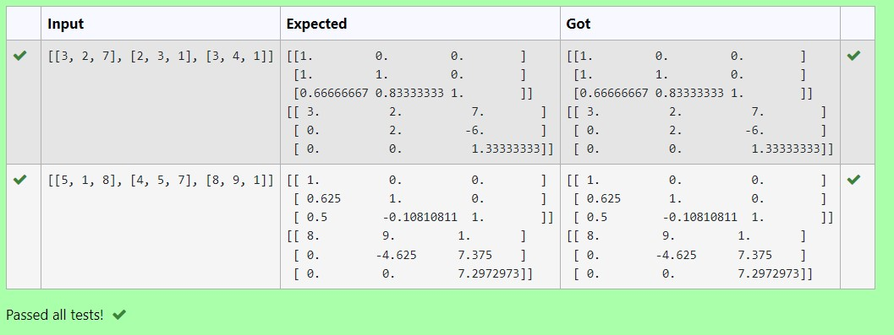
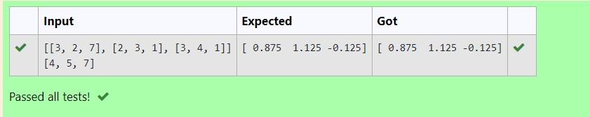

# LU Decomposition 

## AIM:
To write a program to find the LU Decomposition of a matrix.

## Equipments Required:
1. Hardware – PCs
2. Anaconda – Python 3.7 Installation / Moodle-Code Runner

## Algorithm
### STEP1: 
Write a python program.
### STEP2: 
Use numpy as np and open a special library named scipy.
### STEP3: 
Usinng eval data type get the input from the user.
### STEP4: 
Now complete the program and display the output and end the program.
 
## Program:
(i) To find the L and U matrix
```python
import numpy as np
from scipy.linalg import lu
A =eval (input())
P,L,U=lu(A)
print(L)
print(U)
/*
Program to find the L and U matrix.
Developed by:Sri Karthickeyan Ganapathy 
RegisterNumber: 22008592
*/
```
(ii) To find the LU Decomposition of a matrix
```python
import numpy as np
from scipy.linalg import lu_factor,lu_solve
a = eval(input())
b = eval(input())
lu,piv = lu_factor(a)
x= lu_solve((lu,piv),b)
print(x)
/*
Program to find the LU Decomposition of a matrix.
Developed by: Sri Karthickeyan Ganapathy 
RegisterNumber: 22008592
*/
```

## Output:



## Result:
Thus the program to find the LU Decomposition of a matrix is written and verified using python programming.
